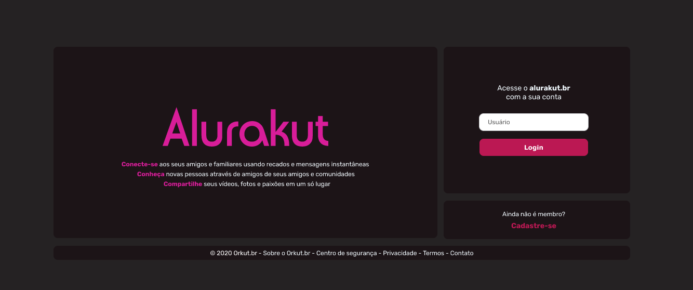

# IMERSÃO REACT 3
## Alurakut

  

## Descrição
  O projeto foi desenvolvido na Imersão React 3 junto com a plataforma Alura, cujo objetivo foi de desenvolver uma réplica do Orkut
##### Tecnologias
  1. Javascript
  2. HTML
  3. CSS
  4. ReactJS

### Design:

### Giovanna Trigueiro

